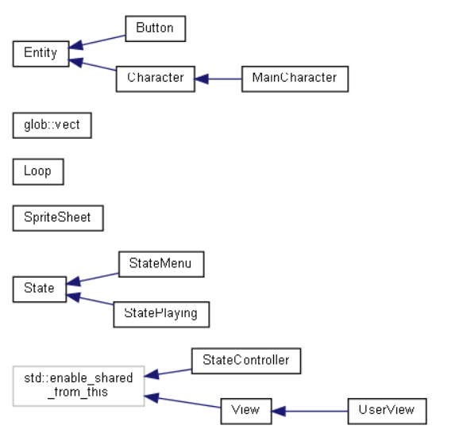

## DESCRIPTION

- Uses C++ and the SFML graphics library
- Class hierarchy:

```
main <- StateController <-> State
                            |- StateMenu
                            |- StatePlaying <-------------- Entity
                            |               <- View <-------|
                            |                  |- UserView  |- Character
                            |                  |- AIView    |  |- Enemy
                            |                               |  |- Player
                            |                               |- Wall
                            |                               |- Item
                            |- StatePaused
```


(Learn how to generate this diagram and other useful UML diagrams in [docs](https://github.com/GDC-WM/2DGame2021/tree/main/docs))

## Windows Setup

[Guide](https://dolomite-scale-0eb.notion.site/Cmake-SFML-on-windows-18e1d0634d774f31898aa5ceded4e24f)

After following the guide, your computer is equipped with the tools
to run this game. Let's run this game. Open up a terminal and run:

```shell
# Clone this repo to your computer

git clone https://github.com/GDC-WM/2DGame2021.git

# Go into the newly cloned repo

cd 2DGame2021

# Make a Debug folder (this is where binaries go), go into Debug folder

mkdir Debug
cd Debug

# .. refers to the parent directory of the curren directory
# cmake generates a MakeFile by utilizing the CmakeList.txt

cmake ..

# Makes the MakeFile, this generates the game's executable

ninja

# Run the exectuable

main.exe
```

Everytime you make an edit on your local end, you have to compile again before
you run to get the latest changes to do this, run

```shell
# you should be in Debug folder

# Must run if you have created or deleted files
cmake ..

# Run everytime
ninja

# Run executable
main.exe

```

## Linux, MacOS Setup

Install dependencies: `make`, `cmake`, `gcc`, `sfml`

- To Build And Run:

```shell
git clone https://github.com/GDC-WM/2DGame2021.git
mkdir 2DGame2021/Debug
cd 2DGame2021/Debug
cmake ..
make
./main
```

- To Run

```shell
cmake .. # if new or deleted files
make
./main
```
